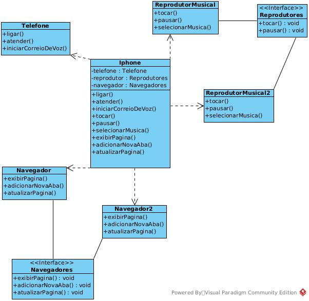

# Projeto iPhone - Reprodutor Musical,Navegador e Telefone :iphone:

Este projeto é uma demonstração simples de modelagem e implementação em Java, representando um iPhone com funcionalidades de Reprodutor Musical e Navegador Web.

## Funcionalidades

O projeto inclui as seguintes funcionalidades:

- Reprodutor Musical: tocar, pausar e selecionar música.
- Navegador Web: exibir página, adicionar nova aba e atualizar página.
- Telefone: ligar, atender, iniciar correio de voz.
  
## Descrição das Classes e Interfaces

### Classe IPhone

A classe `IPhone` representa o dispositivo iPhone, sendo a classe principal que agrupa todas as funcionalidades do aparelho, como reprodutores de música, navegadores e telefone.

### Interfaces

#### Interface MusicPlayers

A interface `MusicPlayers` define os métodos comuns para os reprodutores de música do iPhone, como `play()` e `pause()`.

#### Interface Browsers

A interface `Browsers` (posteriormente refatorada para uma classe abstrata) define os métodos comuns para os navegadores do iPhone, incluindo `displayPage()`, `addNewTab()` e `updatePage()`.

### Classes Concretas

#### Classes MusicPlayer1 e MusicPlayer2

As classes `MusicPlayer1` e `MusicPlayer2` implementam a interface `MusicPlayers` e adicionam suas próprias funcionalidades específicas, como o método `selectSong()`.

#### Classes Browser1 e Browser2

As classes `Browser1` e `Browser2` estendem a classe abstrata `Browser` (anteriormente uma interface) e adicionam suas próprias funcionalidades específicas, como os métodos `addFavorite()` e `viewHistory()` para `Browser1`, e `addBookmark()` e `clearHistory()` para `Browser2`.

#### Classe Phone

A classe `Phone` representa as funcionalidades do telefone do iPhone, com os métodos `makeCall()`, `answerCall()` e `startVoiceMail()`.

## Utilização dos Conceitos de POO

Para demonstrar a aplicação dos conceitos dos pilares da Programação Orientada a Objetos (POO), foram utilizados os seguintes princípios:

1. **Abstração**: As interfaces `MusicPlayers` e `Browsers` representam a abstração das funcionalidades comuns dos reprodutores de música e navegadores, permitindo que outras classes possam implementá-las.

2. **Encapsulamento**: As classes `MusicPlayer1`, `MusicPlayer2`, `Browser1`, `Browser2`, e `Phone` encapsulam suas funcionalidades internas e escondem detalhes de implementação dos usuários, permitindo o acesso apenas aos métodos públicos definidos nas interfaces ou na própria classe.

3. **Herança**: As classes `MusicPlayer1`, `MusicPlayer2`, `Browser1`, e `Browser2` estendem a classe abstrata `Browser`, herdando funcionalidades comuns e possibilitando a especialização com métodos adicionais. A classe `Phone` não utiliza herança ou implementação de interfaces.

4. **Polimorfismo**: Através das interfaces `MusicPlayers` e `Browsers`, as classes concretas podem ser tratadas genericamente, permitindo o polimorfismo e a substituição de objetos durante a execução do programa. A classe `Phone`, embora não implemente interface, também pode ser tratada genericamente, caso necessário.

## Como Executar o Projeto

1. Clone o repositório ou baixe o código-fonte do projeto.

2. Abra o projeto em um ambiente de desenvolvimento Java, como o Eclipse ou IntelliJ.

3. Localize a classe `IPhoneApp` que contém o método `main`.

4. Execute o método `main` para testar as funcionalidades dos reprodutores de música, navegadores e telefone do iPhone.

## Considerações Finais

Esse projeto demonstra uma aplicação básica dos conceitos da Programação Orientada a Objetos em um cenário de simulação de funcionalidades de um iPhone. É importante ressaltar que em projetos mais complexos, outros princípios e boas práticas da POO podem ser aplicados para alcançar maior organização, manutenção e escalabilidade.